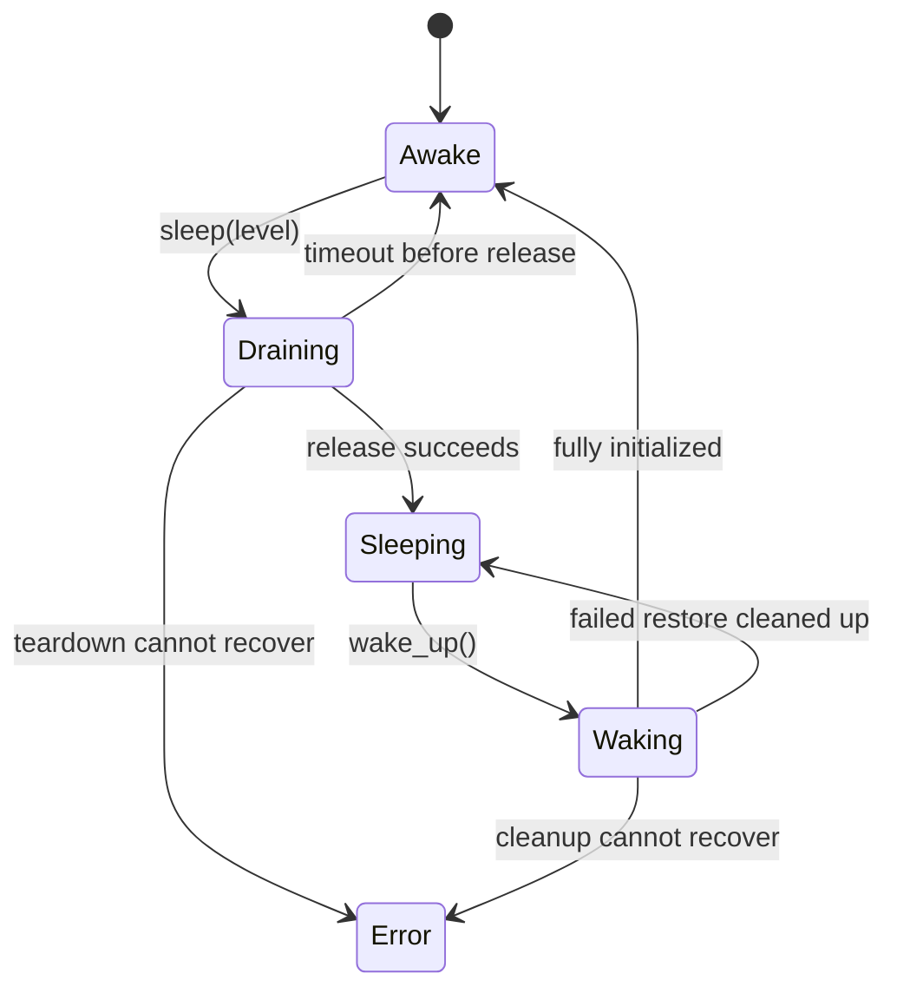

# Model offloading and conversation preservation

Research date: 2026-10-02. Reviewed against TensorFold **0.6.3**,
revision `9356df5c424b0c36b7737e37873a6f968b08de79`.
Initial investigation used 0.6.1 (`17c73e189f5e6a5304cda7ea37f086f9c49b4788`);
the release changes below were reviewed after syncing to 0.6.3.
Status: implementation proposal; no runtime changes made.

Build **weights sleep/wake first**, then preserve conversation caches through that lifecycle.
Implement Level 2 first because it benefits both discrete and unified-memory machines.
Add Level 1 for discrete CUDA GPUs. Keep the HTTP server and its conversation metadata alive.

The agreed scope is sleep between requests and subsequent conversation continuation.
Streaming weights or KV during active inference, enlarging the active context beyond memory,
and suspending a partially emitted reply are separate projects.

## Release review: 0.6.1 to 0.6.3

The release adds the Anthropic Messages API, a macOS service manager and terminal
dashboard, vision features, and Nemotron/Flash Next performance improvements. The
intervening 0.6.2 also fixes interrupted snapshot writes. These releases retain the
exact-output contract. [Release notes](https://github.com/ashhart/TensorFold/releases/tag/v0.6.3),
[local changelog](../../CHANGELOG.md)

| Inspected change | Effect on this proposal |
| --- | --- |
| [`QwenCudaVision._on_gpu()`](../../src/tensorfold/vision/qwen_cuda.py) holds the tower in CPU RAM, serializes its GPU visits with a lock, then moves it back in `finally` when `--vision-offload` is enabled | An existing component-level Level 1 pattern. Integrate with its lock and ownership; whole-model Level 2 must also release this CPU-resident tower. Packed language weights still need explicit adapters. |
| [`serve_options.py`](../../src/tensorfold/serve_options.py) rejects `--vision-offload` on MLX but does not distinguish discrete from unified CUDA | Do not copy this backend-only gate for whole-model Level 1; our unified-memory policy still requires topology detection. |
| [`anthropic.py`](../../src/tensorfold/server/anthropic.py) adds Messages generation and token counting; [`token_routes.py`](../../src/tensorfold/server/token_routes.py) adds tokenization helpers | Gate Messages generation too. Some counting/tokenization paths call app preparation or consult engine metadata, so decouple those before promising they remain available during sleep. |
| [`capacity.py`](../../src/tensorfold/cuda/capacity.py) adds `TENSORFOLD_CUDA_MEMORY_LIMIT_GB`; [`memory_gate.py`](../../src/tensorfold/cuda/memory_gate.py) subtracts live allocations from that absolute cap | Wake must respect the explicit cap, pool reserve and current availability. In 0.6.3 the variable is a cap; a different hard-override interpretation is still under upstream review. |
| [`prefix_snapshots.py`](../../src/tensorfold/engine/prefix_snapshots.py) uses PID-specific partial files, removes failed writes and offers stale-partial cleanup | Reuse this for later KV preservation; successful whole-sleep manifests and preservation rollback still need implementation. |
| [`Scheduler.submit_many()`](../../src/tensorfold/cuda/scheduler.py) publishes decision groups atomically | Lifecycle admission must cover grouped decisions and their pending work, as well as ordinary stream submissions. |
| [`control/`](../../src/tensorfold/control/) manages processes and polls health; it does not implement model sleep | Expose sleeping/waking through health and update control telemetry and doctor to recognize those states. Process stop/restart remains distinct from sleep/wake. TUI sleep actions can follow a working API. |
| CUDA conversation-aware eviction was reverted in `a5f518b` before release | Keep the current prefix-cache behavior as the baseline; do not depend on PR #190 yet. |

The new [contribution guide](../../CONTRIBUTING.md) calls for reviewing upstream's
[Landing next](https://github.com/ashhart/TensorFold/issues/286) and open PRs before coding.
That review found no whole-model sleep/wake entry in the open issue/PR list inspected.
Adjacent proposals include [#219](https://github.com/ashhart/TensorFold/pull/219) for a
common CUDA communicator, [#265](https://github.com/ashhart/TensorFold/pull/265) for
reply-end checkpoints, [#263](https://github.com/ashhart/TensorFold/pull/263) for image
prefix reuse, and [#287](https://github.com/ashhart/TensorFold/pull/287) for later prompt
checkpoints. Recheck their status before the relevant TP/KV implementation; none is
assumed part of 0.6.3.

The implementation order remains **Level 2 weights, Level 1 weights on discrete CUDA,
then conversation preservation**. Initial qualification with drafts disabled is only
a diagnostic baseline: a shippable feature must support the existing lane/drafting
paths and prove drafted-versus-serial and concurrent-versus-solo exactness, as the
contribution guide requires.

## What the levels mean

| Mode | TensorFold proposal | Supported memory architecture | Conversation cache behavior |
| --- | --- | --- | --- |
| Level 1 | Preserve loaded weights in CPU RAM; restore them to GPU on wake | Discrete CUDA GPU | Release live conversation caches; the next turn prefills again until CUDA gains the later saved-prefix store |
| Level 2 | Release loaded weights; reload the same checkpoint from local disk on wake | Discrete CUDA, unified CUDA such as GB10, and MLX | On MLX, run the existing best-effort recent-conversation save before releasing caches and re-index snapshots on wake; CUDA initially prefills again |
| Later: preserve conversations | Save compatible prefix checkpoints before releasing their memory; restore matching checkpoints on demand | CPU storage with Level 1; disk storage with Level 2 | Preserve attention and recurrent state at reusable prompt boundaries |

**Preserving conversation caches is the preferred final behavior.** It avoids repeating
an expensive prefill after wake. Releasing them in the first milestone is an implementation
scope choice following the weights-first sequence, not a requirement of either level.
Keeping caches on the GPU would reduce the memory reclaimed; offloading them to CPU
with Level 1 would recover that GPU memory while keeping the conversation ready to restore.
That adds host-memory budgeting and reliable restoration of K/V, recurrent state and
cache metadata. Level 2 needs the corresponding disk snapshot path.

The first milestone preserves the conversation transcript but may recompute its model
state. The next milestone preserves reusable model state too. Temporary execution
scratch and address-dependent graph resources can still be rebuilt: they have a
different purpose from the conversation state we want to retain.

vLLM confirms Level 1 backs up weights to CPU and drops KV. Its Level 2 drops weights
and KV, retaining some model buffers; it does **not** serialize a new weight snapshot to
disk. Its documented recovery sequence allocates weights, explicitly reloads them,
then allocates KV. TensorFold can wrap restoration into a single serving-oriented wake
operation. [vLLM sleep documentation](https://docs.vllm.ai/en/latest/features/sleep_mode/)

For immutable inference weights, the existing local checkpoint is already the Level 2
backing store. Validate and retain its exact identity before sleep. A converted runtime
weight snapshot might accelerate later wake-ups, but adds serialization and compatibility
work; measure ordinary checkpoint reload first. Changed in-memory weights would require
an explicit save path and are outside this initial proposal.

Unified memory gets Level 2 only, as requested. MLX arrays share one physical pool
between CPU and GPU, so selecting CPU execution does not move their storage out of
that pool. Unwiring weights also does not release their live allocations.
[MLX unified-memory documentation](https://ml-explore.github.io/mlx/build/html/usage/unified_memory.html)

## Findings in TensorFold

| Area | Existing behavior | Consequence for implementation |
| --- | --- | --- |
| [CLI loading](../../src/tensorfold/cli.py) | `_serve_mlx` calls the family loader; `_serve_cuda` calls its engine factory. Local variables retain the loaded model/weights while serving. | Extract a reload specification and give runtime ownership to a replaceable object. Clearing only `app.engine` will not unload everything. |
| [MLX app](../../src/tensorfold/server/app.py), [lane engine](../../src/tensorfold/engine/lane_engine.py) | App, engine, scheduler and bound cache callbacks hold runtime references. | Detach the complete runtime and callbacks on sleep; retain the frontend. |
| [MLX scheduler](../../src/tensorfold/server/scheduler.py) | One thread owns execution. `on_engine()` runs work when idle, but the loop admits work before handling those calls. | Add an admission barrier before relying on an idle callback. Otherwise sleep can race or starve under traffic. |
| [MLX residency](../../src/tensorfold/server/residency.py) | `wire_resident()` and `unwire()` already wrap the wired-memory limit. | Reuse these around release/reload, plus synchronization and actual reference teardown. |
| [CUDA request turns](../../src/tensorfold/cuda/turns.py), [scheduler](../../src/tensorfold/cuda/scheduler.py) | Serial engines use `Turns`; concurrent engines use a worker scheduler. Closing the latter stops its worker and releases its decoder reference. | Both paths need lifecycle exclusion. A stopped thread must be replaced on wake. |
| [CUDA weights](../../src/tensorfold/families/qwen3_5/cuda/weights.py) | Weights include dataclasses, packed tensors, quantization metadata and auxiliary buffers. | A generic `model.cpu()` or ordinary module `state_dict()` is insufficient. Use explicit family adapters. |
| [CUDA vision offload](../../src/tensorfold/vision/qwen_cuda.py) | `--vision-offload` retains the image tower on CPU between GPU visits. | Coordinate with the tower lock; Level 2 must release CPU weights as well as device weights. |
| [CUDA graphs](../../src/tensorfold/families/qwen4_exp/cuda/graphs.py) | Captures retain static execution addresses, graph pools and output views. | Ordinary unload/reload must destroy captures and recreate them after restoration. |
| [Nemotron CUDA runtime](../../src/tensorfold/families/nemotron_h/cuda/app.py) | `_make` closes over weights; main, serial and MTP engines can share them. | Teardown must include closures, serial twins and draft heads. |
| [CUDA capacity](../../src/tensorfold/cuda/capacity.py) | `unified()` uses the device's `is_integrated` property; memory admission distinguishes host and device budgets. | Require a positive discrete-GPU determination for Level 1. The current helper returns False when querying topology fails; unknown topology must not qualify as discrete. |
| [Responses storage](../../src/tensorfold/server/responses.py) | `previous_response_id` history belongs to a store keyed by the app object. | Preserve that object/store across sleep; replacing the whole app would lose conversation history even if KV survives. |

No sleep/wake lifecycle or endpoints were found in the inspected source.
Existing shutdown methods are useful pieces, not complete unload operations.

## How much of vLLM to copy

vLLM's CUDA allocator tags allocations and uses CUDA virtual memory to release physical
backing while retaining virtual addresses. Selected allocations receive CPU backups.
Wake remaps storage and restores backups. This enables preserving graph address
assumptions. The worker also handles model and draft buffers.
[Allocator](https://github.com/vllm-project/vllm/blob/6e517b15c1833cf72a7f557ee32524d98682e617/vllm/device_allocator/cumem.py),
[CUDA implementation](https://github.com/vllm-project/vllm/blob/6e517b15c1833cf72a7f557ee32524d98682e617/csrc/cumem_allocator.cpp),
[worker lifecycle](https://github.com/vllm-project/vllm/blob/6e517b15c1833cf72a7f557ee32524d98682e617/vllm/v1/worker/gpu_worker.py)

That is a useful later optimization, but a substantial initial dependency: TensorFold
has family-specific allocation paths, cached pointer tables and graph capture code.
It also enables `expandable_segments` in concurrent dense and MoE Qwen engines, while the inspected
vLLM allocator temporarily disables that setting inside its custom pools. The pool
context must cover allocations on the actual engine thread, including later allocations.

| Approach | Benefit | Cost / limitation | Recommendation |
| --- | --- | --- | --- |
| Explicit runtime teardown and reconstruction | Uses existing family loaders; works with both backends | Repeats allocation, some initialization, and graph capture | First implementation |
| CUDA virtual-memory allocator with stable addresses | Potentially much faster wake without graph recapture | Native allocator integration, allocation tagging, driver/PyTorch qualification, careful initialization of discarded buffers | Revisit after measuring wake costs |
| Separate engine worker process | Clear ownership boundary; process exit releases its allocations | New IPC and supervision architecture; loses more warm runtime state | Fallback if in-process ownership proves impractical |

PyTorch graphs replay against the same virtual addresses. Copying tensors to fresh
storage and replaying an old graph is therefore unsafe; `empty_cache()` also does not
free live tensors. Preserve compiled extension modules where possible, while explicitly
destroying captures and runtime tensors that reference old storage.
[PyTorch CUDA semantics](https://docs.pytorch.org/docs/stable/notes/cuda)

## Proposed weights lifecycle

Use a stable frontend containing model IDs, tokenizer/template, request defaults,
Responses history, metrics and lifecycle state. Give it a replaceable runtime holding
target/draft/vision weights, execution state, schedulers and graph resources.
Store loader configuration as paths and scalar settings, without closures over live tensors.
Retain startup-selected values too: MLX must reuse its measured prefill chunk size, which
contributes to snapshot identity, and CUDA must admit the already-served context as an
explicit requirement on wake. Re-running automatic selection must not change either.



1. **Close admission atomically.** Cover chat, completions, Responses, Anthropic Messages,
   individual/grouped decisions, image/video encoding and background warmups. Let the finite set of already accepted
   requests drain. New generation requests receive a structured 503 while draining,
   sleeping or waking. Keep health, model discovery and stored-response reads available.
   A timeout before teardown returns the runtime to awake operation.
2. **Synchronize on the owner thread.** Finish pending GPU work and join or park workers.
   Sleep/wake must be serialized with one another. Expose liveness separately from
   generation readiness; report the actual transition state.
3. **Release by level.** On MLX, first run the existing owner-thread best-effort session
   save (two newest conversations by default, or the configured spill budget); wake
   re-indexes those files. This retains existing behavior without promising complete KV
   preservation. Level 2 releases target, draft and vision weights, retained
   prefixes, recurrent state, scratch tensors, graph pools, pointer tables and file
   mappings owned by the runtime. MLX also unwires memory. Then collect unreachable
   objects and clear freed-buffer caches. Level 1 first secures CPU backups of all
   needed weights and persistent model buffers, preserving aliases and tensor layouts.
4. **Wake transactionally.** Recheck available memory and unchanged checkpoint identity.
   Load weights from disk or restore CPU backups, recreate execution buffers and
   workers, rebind frontend callbacks, and initialize graphs. Reopen admission only
   after success. Clean up partial allocations on failure and retain a retryable
   sleeping state; retain CPU backups until the Level 1 restore commits. If teardown or
   cleanup cannot recover, enter Error, keep admission closed and report the failure.
   Stop the service with a nonzero exit so its supervisor can restart it; do not attempt
   another in-process wake from an unverified runtime. Responses history is only preserved
   across successful in-process cycles, not a terminal process restart.

For Level 1, budget CPU memory before making backups. Prefer bounded pinned staging
buffers over pinning the entire model by default; account for both retained backups
and temporary copies. Reconstruct shared views from a storage manifest or explicit
adapter, including packed weights and scales. Never dequantize as a side effect of
offloading. Device address tables must be rebuilt after tensors move.

Level 2 weights sleep writes no new weight snapshot. Wake needs bounded loading buffers;
later conversation-snapshot writing also needs bounded staging on unified memory, because
copying the entire runtime to CPU would duplicate data in the same physical RAM.
TensorFold's [CUDA checkpoint reader](../../src/tensorfold/cuda/direct_read.py) already
uses bounded pinned staging for device reads. It is a useful loading primitive, not
yet a general state snapshot writer. Measure physical process footprint and system
available memory; file-page cache and CUDA context overhead need separate accounting.

Keep the served context/settings stable on wake, including the explicit CUDA memory cap
and reserve introduced or revised in 0.6.3. If they no longer fit, return a clear
failure rather than silently changing execution behavior or advertising readiness.

Proposed opt-in interface, not existing commands:

```text
tensorfold serve MODEL --enable-sleep-mode
POST /sleep?level=2
POST /wake_up
GET  /is_sleeping
```

Level 1 on unified memory returns an explicit unsupported-mode error. Repeating the
same completed operation is idempotent; conflicting transitions return a conflict.
The initial API needs neither partial resource wake nor arbitrary model replacement.
Administrative lifecycle routes must be opt-in and authenticated; TensorFold has no
separate authenticated admin listener today. Require a nonempty startup secret from a
named environment variable, presented in an Authorization bearer header, for all three
routes on every bind address. Reject browser-origin lifecycle calls and unauthorized
requests before changing state. TensorFold can borrow vLLM's endpoint names without
adopting its generic RPC API. Wake is explicit: ordinary requests receive 503 while asleep.
A failed Level 1 host backup leaves the runtime awake; never silently switch levels.

Tensor parallelism requires additional implementation, not just invoking sleep on
rank 0. Existing `follow()` loops understand inference traffic. Add coordinated lifecycle
commands, an operation generation ID, all-rank acknowledgements and failure propagation;
control communication must remain usable while tensor storage is absent. Retain or
explicitly reconstruct communicators. Refuse unsupported TP sleep until this is implemented.

## Subsequent milestone: preserve conversations

Preserve reusable conversation prefixes across sleep/wake. There is no need to keep a
live HTTP stream suspended. Ordinary chat callers still send conversation messages;
Responses callers retain their existing `previous_response_id` chains in the frontend.
KV snapshots accelerate reconstructing model state; they are not a replacement for
the conversation transcript.

The MLX path already has much of the storage machinery:

- [Prefix snapshots](../../src/tensorfold/engine/prefix_snapshots.py) write tensors and
  metadata to safetensors through a PID-specific temporary file and rename, clean up failed writes, restore cache classes,
  and index matching prefixes without eagerly loading every tensor.
- [Checkpoint storage](../../src/tensorfold/server/checkpoints.py) spills evicted
  conversations and saves selected conversations at shutdown. Current shutdown defaults
  save only two non-pinned entries; that is not a guarantee to preserve every retained conversation.
- [Scheduler restoration](../../src/tensorfold/server/scheduler.py) chooses the longest
  usable prefix on disk, checks memory admission and restores it on demand.
- [CUDA PrefixCache](../../src/tensorfold/cuda/streams.py) retains prompt tokens, model
  state and drafter snapshots in memory; it has no equivalent disk serialization here.

Reuse MLX's selection and restore logic, then add explicit CUDA state codecs behind a
common snapshot-store contract. Avoid importing the MLX-specific serializer into CUDA.
Start with whole reusable checkpoints; block deduplication can wait for measurements.

The stored state must include all information needed to resume at that boundary:
K/V and any quantization scales, valid lengths/positions, convolution history,
recurrent state, model-specific attention/index state and compatible drafter context.
For example, [dense Qwen's CUDA State](../../src/tensorfold/families/qwen3_5/cuda/forward.py)
holds `conv`, `rec`, `kv`, `pos`, `limit` and rotary metadata. Saving only `kv` is insufficient.
[DFlash2](../../src/tensorfold/families/qwen3_5/cuda/dflash2.py) maintains its own context
lengths and caches. MLX deliberately excludes some drafter slots today; each adapter
must prove a correct reset/rebuild path or persist that state explicitly.

Snapshot identities should extend the existing runtime/kernel/prefill identity with
the actual weight revision or content manifest, family, backend, precision settings,
KV layout/dtype, relevant hardware execution mode and TP world/rank. A local directory
path alone cannot detect overwritten weights. Never restore caches across incompatible
weights, runtimes or quantizations. Image prefixes require image/processor identity and
position metadata; current MLX checkpoint retention skips image jobs, so text-only
qualification must not be presented as vision support.

Sleep should finish writing and validating the selected snapshots before dropping
their sole in-memory copies. Publish a manifest only after every file succeeds; for TP,
commit only after all ranks succeed. On insufficient disk space or serialization failure,
remain awake by default when preservation was requested. Do not reuse the current
best-effort shutdown behavior as a strict preservation guarantee. Report saved, omitted
and already-unavailable checkpoints; this cannot recover state evicted before sleep.

Wake restores weights and runtime first, then indexes disk snapshots. Load the matching
conversation on its next request under normal admission. This keeps unrelated histories
off the GPU and avoids a weight-plus-all-KV peak. Level 1 can initially keep the equivalent
checkpoint representation in CPU RAM. Snapshot files should remain owned by the cache
store and have explicit capacity/eviction policy, independent of weight checkpoints.

Promise reuse of the longest **valid prompt prefix**, not zero prefill. TensorFold's
prompt chunking, strict-prefix rules and templates can require recomputing the previous
reply and new turn. Retaining those existing rules preserves its exact-decoding contract.
Graph warmup can dirty sequence buffers; restore conversation state after such warmup.

vLLM also has a separate KV offloading connector with a CPU tier and optional filesystem
tiers, restoring completed prefix blocks on demand. It is a design reference, not a
drop-in adapter for TensorFold's hybrid state. Its sleep path resets caches, so configuring
the connector alone does not establish conversation-preserving sleep semantics.
[KV offloading guide](https://docs.vllm.ai/en/latest/features/kv_offloading_usage/),
[engine sleep/reset implementation](https://github.com/vllm-project/vllm/blob/6e517b15c1833cf72a7f557ee32524d98682e617/vllm/v1/engine/core.py)

## Implementation sequence and proof

| Step | Deliverable | Required evidence |
| --- | --- | --- |
| 1 | Stable frontend, lifecycle gate, explicit runtime ownership; one Level 2 family path | Drain races handled; tensors released; same model wakes and serves the same deterministic fixture |
| 2 | Level 2 adapters on MLX and CUDA | Physical memory reduction measured separately on Apple Silicon, GB10 and a discrete GPU; draft and vision ownership included in each advertised capability |
| 3 | Level 1 on discrete CUDA | CPU backup is complete and within budget; aliases/packed formats survive; repeated restore preserves outputs |
| 4 | Conversation checkpoint preservation, MLX first then CUDA | Next-turn tokens match a continuously awake baseline and reuse the valid saved prefix |
| Separate track | TP lifecycle and remaining family adapters | All ranks transition together; failed rank or wake OOM never produces a partially ready service; this does not gate conversation preservation |
| 6 | Optimize measured wake bottlenecks | Consider runtime weight snapshots or VMM only if reload/recapture materially dominates |

Start qualification with dense Qwen text inference on one device and drafts disabled,
then add DFlash2, concurrent requests, a graph-heavy family, vision and TP. Use explicit
capabilities for backend/family/level combinations until each is qualified.

For weights, compare cold start, awake inference, Level 2 wake and Level 1 wake using
the same checkpoint and settings. Record sleep time, wake-to-ready, first-token latency,
post-wake throughput, bytes released, remaining allocations, CPU backup bytes and peak
restore memory. Run repeated cycles and inject host OOM, GPU OOM, missing/changed checkpoint,
drain timeout and concurrent sleep/wake. Validate requests through all generation routes
and retained Responses history. Compare deterministic token IDs before and after sleep.

For later KV preservation, compare next-turn latency and cached-token counts against
both the awake prefix-cache baseline and a cache miss. Test hybrid states, seeded sampling,
drafted/serial execution, incompatible identities, corrupt/truncated files, capacity limits
and disk-full rollback. Preserve bits in the snapshot; adding lossy KV compression is a
separate accuracy decision.

The approximate lower bounds are `resident_weight_bytes / effective_transfer_bandwidth`
for Level 1 and `checkpoint_bytes / effective_disk_bandwidth` for Level 2, before conversion,
allocation and graph initialization. Cache restoration helps latency when reading and
reconstructing a valid prefix costs less than prefilling it. Benchmark both warm and cold
filesystem-cache conditions; there is no hardware-independent wake-time promise.

Existing foundation checks on the initial 0.6.1 investigation:

```text
.venv/bin/python -m pytest tests/test_checkpoint_spill.py tests/test_prefix_snapshots.py tests/test_issue155_spill.py -q
15 passed in 1.46s
```

After syncing to 0.6.3, the focused checkpoint, memory-budget, HTTP, Anthropic and vision
host checks also passed:

```text
.venv/bin/python -m pytest -q tests/test_checkpoint_spill.py tests/test_prefix_snapshots.py tests/test_issue155_spill.py tests/test_partial_snapshots.py tests/test_cuda_live_budget_host.py tests/test_flashnext_absolute_grow_host.py tests/test_anthropic_api.py tests/test_http_request_bodies.py tests/test_token_routes.py tests/test_vision_server.py
204 passed, 2 subtests passed in 27.98s
```

These research-stage checks validate existing checkpoint behavior, not offloading.
Subsequent implementation and hardware evidence are recorded in the
[prototype validation](model-sleep-validation.md).
